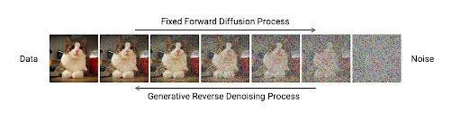

# Stable Diffusion原理解读

## diffusion原理

众所周知，Stable Diffusion是个AI模型，这个模型的主要功能就是从一张图片里面预测噪声，如果我们将图片上的噪声去除了，那么图片就会更清楚一点，这就是我们平时见到的图像去噪/修复功能。

那如果我们尝试从一个噪声图片中不断地预测噪声，并去除这些噪声是不是就可以从一张噪声中“还原”出一个图像呢？没错，这就是Stable Diffusion的原理，下图就是Stable Diffusion生成图片的过程

这个过程称为反向扩散，因为正向扩散就是给一张图不断加上噪声的过程，因此这类从噪声中还原图像的模型也统称为diffusion模型

.gif>)

## Stable Diffusion模型结构

前面[3.文生图基础参数介绍](https://z28pynubvc.feishu.cn/wiki/wikcnrjFpxQwruYo72slhGW1Axc) 介绍过，Stable Diffusion模型包含VAE等部分，现在就来说说Stable Diffusion的结构和一些**术语**，以便理解webui上的参数是干什么用的

### VAE(Variational AutoEncoder)

[3.文生图基础参数介绍](https://z28pynubvc.feishu.cn/wiki/wikcnrjFpxQwruYo72slhGW1Axc) 介绍过，这是一个实现 压缩-解压 过程的AI模型，图像压缩后的空间称为latent space（潜变量空间），压缩后的图片就称为latent（潜变量），这是因为压缩后的图片是原始图片的“根本潜在表达”。

比如一个人脸可以用「眼睛多大，嘴巴多大，鼻子多高」这些变量来描述，这样一张巨大的图片只需要少量的几个变量就能描述了。

不用怀疑，调整更少的变量肯定比直接调整像素图片快得多。其实采用vae这个技术在潜变量空间处理图片从而提速的功能，正是让Stable Diffusion脱颖而出的关键。

当然也正如[3.文生图基础参数介绍](https://z28pynubvc.feishu.cn/wiki/wikcnrjFpxQwruYo72slhGW1Axc) 所说，如果这个潜变量空间没学习到位，解压后容易产生畸变

### Unet

这是一个AI模型，只要知道这就是前面提到的用来预测噪声的就行了，处理主体流程就是在这上面进行，这个模型输入就是我们引导的文本和图片，输出就是预测的噪声

### CLIP(包含tokenizer和text\_encoder)

我们知道AI绘图是用文本引导，AI模型其实是不懂人类语言的，所以需要CLIP将文本转换成AI模型能够理解的向量表达。

CLIP包含了两部分tokenizer和text\_encoder，其中tokenizer就是将一个句子转换成一个个单词的工具，英文最简单只要用空格来分词，中文会复杂一些。text\_encoder就是把分词后的单词转换成AI模型能够理解的向量的工具。

这里只需要知道不同CLIP方法能够不同程度的理解人类语言，比如ChatGPT4比ChatGPT3更懂语言一样。

这部分在整体模型中是固定的，不用我们选择，只需要知道Stable Diffusion2采用了OpenAI公司的OpenCLIP，所以效果比Stable Diffusion1更好，因此二者模型也不兼容！当然webui会自动检测模型是哪个版本的，我们不用在意这些区别。

### Sampler(Scheduler)采样方法

虽然已经有了Unet预测噪声，但是具体的从噪声中还原图像的算法还是多种多样的，具体来说Unet控制了单次预测噪声效果，而sampler控制了整体的还原流程。

迭代次数的含义其实有两个：迭代总数和生成的迭代次数

迭代总数在训练模型时就固定了，大都模型是1000次。生成的迭代次数就是这里的参数，sampler(scheduler)就是将迭代总数规划成迭代次数个具体步骤的规划器

举个例子，设迭代次数为50次，迭代总数为1000，那么sampler(scheduler)采用**线性规划**方法(意味着有其他方法)规划出的具体步骤为：

`[980, 960, 940, 920, 900, 880, 860, 840, 820, 800, 780, 760, 740, 720, 700, 680, 660, 640, 620, 600, 580, 560, 540, 520, 500, 480, 460, 440, 420, 400, 380, 360, 340, 320, 300, 280, 260, 240, 220, 200, 180, 160, 140, 120, 100, 80, 60, 40, 20, 0]`

具体步骤的数字**的间隔**代表一次迭代对图片加了多少次噪声，即Unet每次需要预测的是多少次噪声的叠加，比如这里代表一次是预测20次噪声的叠加，这也是为什么迭代次数过少图容易崩的原因（一次预测太复杂的东西了）

不同sampler主要的差异还是在于还原速度上，新的采样方法20次迭代就能收敛，而有的旧方法需要30\~50次。

当然因为整体流程有点差异，效果也有些许轻微不同。

## 文生图原理

前面说了Stable Diffusion能从噪声图片中“还原”出一张图片，那我们首先需要一个噪声，当然我们不用一个和想要生成图像一样大小的噪声图片，我们只需要在“潜变量空间”随机生成一个噪声图片就可以了，所以我们文生图中噪声种子控制的就是在“潜变量空间”中生成噪声的分布

接着在“潜变量空间”里将图片还原后，通过VAE解压缩还原到原始图片空间，就能从「多大的鼻子、多大的眼睛」这个潜变量空间里恢复真正的图片了

也因此在种子确定，文本提示等条件都确定的情况下，AI模型会“还原”出一样的初始图片

## 图生图原理

我们知道文生图是从随机噪声中还原图片，那图生图要怎么叠加上原图进行还原呢？

很简单，首先假设每个图还原过程我们设定了t次迭代，比如20次，那我们只需要把原图加上20次噪声，就变了了一个噪声图片了，我们就可以接下来进行和上面一样的还原过程了。

## 局部绘图(inpaint)

### 全图重绘

那我们怎么控制和原图的相似程度呢，其实我们只要把加了20次噪声后的图片分别按照原本的加噪路径不断去噪，及按新咒语去噪图片，并在每一次去噪后，把两张图融合到一起用于下一次迭代。

这就是重绘区域为全图的原理了，可以看到融合这一步可以分别控制两边的融合权重来控制和原始图片的相似度，这就是「重绘程度」这个参数的用武之地了&#x20;

### .png>)

### 蒙版重绘

那蒙版是怎么实现的呢？也很简单，在融合时候只把按新prompt去噪的图片蒙版内区域和按原始路径去噪的图片融合，剩余部分完全采用按原始路径去噪的图片，这就实现了蒙版功能

### 也可以用不同初始化图片

刚才说的按新prompt去噪的图片是原图加噪t次来的，当然也可以用随机噪声、蒙版原图边上区域、纯黑色来初始化，这就对应了「蒙版蒙住的内容」这个参数的四个选项（原图、潜变量噪声、填充、潜变量值为零）

## 接下来

接下来可以看看怎么使用不同的Stable Diffusion拓展技术了！比如从[使用不同模型](https://z28pynubvc.feishu.cn/wiki/wikcnqEbsAhY6w9J4nVP92btuRh) 开始

